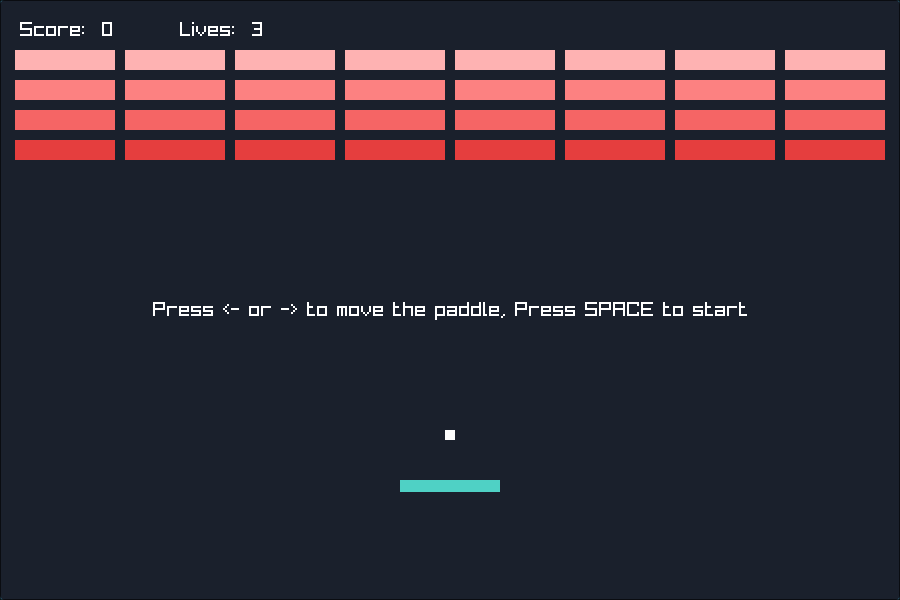

# Bricks

A breakout-style game built in [Odin](https://odin-lang.org) with [raylib](https://www.raylib.com).



## Requirements

- [Odin compiler](https://github.com/odin-lang/Odin)
- [raylib](https://www.raylib.com) (bindings included in Odin’s `vendor`)

## Controls

| Key   | Action                                |
| ----- | ------------------------------------- |
| ← / → | Move the bat left or right            |
| SPACE | Launch the ball / Continue after loss |
| P     | Pause / Resume the game               |
| R     | Restart after Game Over / Win         |
| ESC   | Quit the game                         |

## Build & Run

### Build

```bash
odin build .
```

### Run

```bash
./bricks
```

### Build & Run in one step

```bash
odin run .
```
